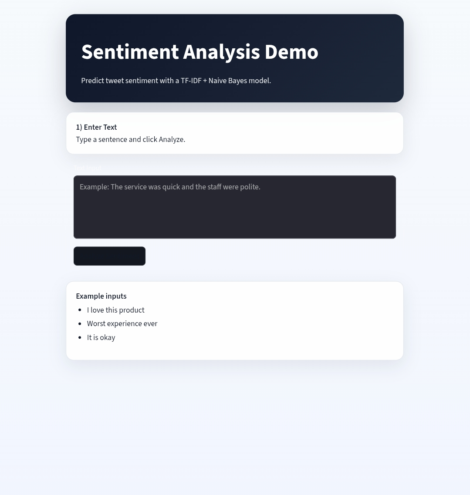

# Sentiment Analysis App

An end-to-end sentiment analysis project built with scikit-learn and Streamlit. It trains a traditional machine learning model on a Kaggle-style CSV dataset and predicts whether text is Positive, Negative, or Neutral.

## Tools Used

- Python 3.x
- pandas
- scikit-learn
	- TfidfVectorizer
	- MultinomialNB
	- train_test_split
	- classification_report, confusion_matrix, accuracy_score
- Streamlit
- Joblib
- Pytest
- Kaggle Sentiment140 dataset

## Approach

1. Data preparation
- Start with Kaggle Sentiment140 raw CSV.
- Normalize to a two-column format: `text`, `sentiment`.
- For this project setup, train on `airline_sentiment_3class.csv` so all three labels are present.

2. Text preprocessing
- Remove URLs.
- Remove special characters.
- Convert to lowercase.
- Remove stopwords.

3. Feature engineering
- Convert cleaned text into TF-IDF vectors using unigram + bigram features.

4. Model training
- Train a Multinomial Naive Bayes classifier.
- Use 80/20 train-test split.

5. Evaluation
- Track accuracy, confusion matrix, and classification report.
- Save metrics to `models/metrics.json`.

6. Inference and UI
- Save trained model to `models/sentiment_model.joblib`.
- Streamlit UI accepts user text and returns sentiment + confidence score.

## Features

- CSV dataset loading and preprocessing
- URL, special character, lowercase, and stopword cleaning
- TF-IDF + Naive Bayes model
- Train/test split with evaluation metrics
- Saved model artifact using Joblib
- Streamlit UI for interactive inference
- Pytest-based sample tests

## Recommended Kaggle Dataset

This project is designed for a CSV that already contains sentiment labels such as:

- `positive`
- `negative`
- `neutral`

A good fit is a Kaggle tweet sentiment dataset such as Sentiment140. If you use a different dataset, pass the correct column names to the training function.

For the classic Sentiment140 raw file (`training.1600000.processed.noemoticon.csv`), first normalize it:

```bash
python -m utils.prepare_sentiment140
```

This creates `data/raw/airline_sentiment.csv` with `text` and `sentiment` columns mapped from labels `0`, `2`, `4`.

## Project Structure

```text
project/
│── data/
│   ├── raw/
│   └── processed/
│── notebooks/
│── models/
│── app/
│── utils/
│── tests/
│── requirements.txt
│── README.md
```

## Setup

1. Create and activate a Python virtual environment.
2. Install dependencies:

```bash
pip install -r requirements.txt
```

3. Ensure the training dataset is available at `data/raw/airline_sentiment_3class.csv`.

If your Sentiment140 file has only positive and negative labels (common binary variant), generate a neutral-inclusive 3-class dataset with:

```bash
python -m utils.prepare_three_class_dataset
```

This creates `data/raw/airline_sentiment_3class.csv` with balanced Positive, Negative, and Neutral classes.

## Training

Run the training script from the `project` folder:

```bash
python -m utils.train_model
```

By default, the script:

- Loads `data/raw/airline_sentiment_3class.csv`
- Saves the trained model to `models/sentiment_model.joblib`
- Saves metrics to `models/metrics.json`
- Saves cleaned data to `data/processed/cleaned_dataset.csv`

## Inference

Use the prediction helper in Python:

```python
from utils.predict import predict_sentiment

result = predict_sentiment("I love this product")
print(result)
```

## Streamlit UI

Start the app with:

```bash
streamlit run app/streamlit_app.py
```

The UI includes:

- Text input box
- Analyze button
- Positive / Negative / Neutral result display
- Confidence score
- Color-coded output styling

Note: Training is intentionally removed from the UI to keep the app focused on prediction-only usage.

## Testing

Run sample tests with:

```bash
pytest
```

The tests cover:

- Text cleaning
- End-to-end training on a tiny local dataset
- Prediction checks for positive, negative, and neutral examples

## Sample Tests (Input and Output)

These are sample inference checks from the trained model:

| Input Text | Predicted Sentiment | Confidence |
|---|---|---|
| I love this product | Positive | 62.27% |
| Worst experience ever | Negative | 74.96% |
| It is okay | Neutral | 92.30% |

Additional sample run:

| Input Text | Predicted Sentiment | Confidence |
|---|---|---|
| Absolutely fantastic service, I am very happy with this purchase. | Positive | 81.05% |
| This is the worst app update ever, completely unusable. | Negative | 81.12% |
| The product is okay and does the basic job. | Negative | 43.31% |

## Application Screenshot

Screenshot file path:

- `docs/app_screenshot.png`

Rendered image:



If image preview still does not render, open it directly:

[Open screenshot](docs/app_screenshot.jpeg)
